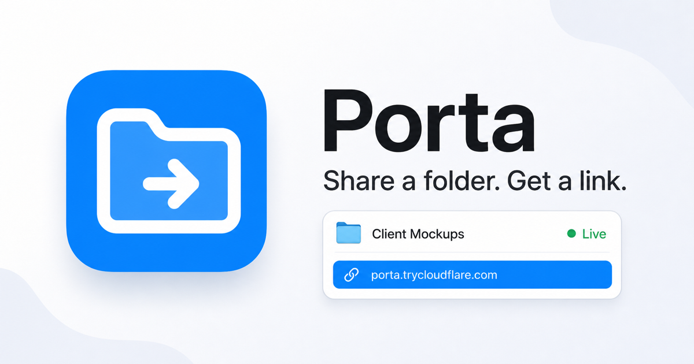

# Porta

Porta is a free desktop app for sharing a folder or local web server with a
public HTTPS link. Pick or drag in a folder, and Porta serves it through a
Cloudflare Quick Tunnel without an account, a terminal command, or a hosted
Porta service. Porta supports Windows 10/11 x64 and Apple-silicon macOS.



## What it does

- Shares folders with browsable directory pages, downloads, and optional uploads.
- Forwards a public URL to an existing service on a local port.
- Adds optional password protection, request/visitor stats, and first-visitor notifications.
- Copies new links automatically and keeps active shares running from the system tray.
- Can launch at login and restart selected shares automatically.
- Stores share settings locally and passwords in the operating system credential store.

Porta bundles `cloudflared`; users do not need to install it separately or
create a Cloudflare account. Porta has no analytics or telemetry.

## Security and appropriate use

A Quick Tunnel URL is hard to guess, but it is **public**. Anyone who receives
the URL can reach the share while it is running. Enable Porta's password option
for sensitive shares, remove uploads unless they are needed, and stop a share
when you are finished.

Password protection uses HTTP Basic authentication at Porta's local server.
The browser connection is HTTPS, but Porta does not provide end-to-end
encryption from the browser through Cloudflare to the shared files, and it
should not be described as doing so.

Cloudflare documents Quick Tunnels as a testing and development feature, not a
production hosting service. They have no SLA, support at most 200 concurrent
in-flight requests, and do not support Server-Sent Events. Use of Porta and
Quick Tunnels remains subject to the
[Cloudflare terms and Quick Tunnel documentation](https://developers.cloudflare.com/cloudflare-one/networks/connectors/cloudflare-tunnel/do-more-with-tunnels/trycloudflare/).

## Install

Download Porta only from the
[official GitHub Release](https://github.com/tanzir71/porta/releases/latest),
then verify the matching `.sha256` attachment before overriding an operating
system warning.

### Windows 10/11 x64

Download
[`Porta_1.1.0_x64-setup.exe`](https://github.com/tanzir71/porta/releases/latest/download/Porta_1.1.0_x64-setup.exe)
and run it. The installer is unsigned, so Microsoft Defender SmartScreen may
show **Windows protected your PC**. Select **More info**, confirm the installer
came from this repository, then select **Run anyway**. Porta installs for the
current user without administrator access.

### Apple-silicon macOS

Download
[`Porta_1.1.0_aarch64.dmg`](https://github.com/tanzir71/porta/releases/latest/download/Porta_1.1.0_aarch64.dmg),
open it, and drag Porta to Applications. The app is ad-hoc signed and not
notarized, so macOS will likely block its first launch:

1. Try opening Porta once, then dismiss the warning.
2. Open **System Settings → Privacy & Security** and scroll to **Security**.
3. Click **Open Anyway**, enter your login password, then confirm **Open**.

Apple makes **Open Anyway** available for about an hour after the blocked
launch. See [Apple's official instructions](https://support.apple.com/guide/mac-help/open-an-app-by-overriding-security-settings-mh40617/mac).

Then drag a folder into Porta or choose **Share a folder**, review the share
options, and use the copied `trycloudflare.com` link. Closing the window hides
it; choose **Quit Porta** from the Windows notification area or macOS menu bar
to stop the resident app and its active tunnels.

## Build from source

Prerequisites are the current stable Rust toolchain, Node.js with npm, and the
target platform's `cloudflared` binary described in
[`src-tauri/binaries/README.md`](src-tauri/binaries/README.md).

```sh
npm --prefix ui install
cargo tauri build
```

Run `cargo tauri dev` from the repository root for development. Windows
installers are built on Windows CI; macOS builds use the matching
Apple-silicon target. To verify the shared code without opening the app:

```sh
npm --prefix ui run test
npm --prefix ui run build
cargo test --manifest-path src-tauri/Cargo.toml
cargo clippy --manifest-path src-tauri/Cargo.toml --all-targets -- -D warnings
cargo fmt --manifest-path src-tauri/Cargo.toml --check
```

## Architecture

Porta is a Tauri 2 application with a React/TypeScript interface and a Rust
backend. Folder shares are served from a loopback-only Axum server, and the
bundled `cloudflared` sidecar connects that server—or a selected local port—to
Cloudflare's edge. Share state is stored atomically in the app-data directory;
passwords are kept out of that file and stored in Keychain on macOS or
Credential Manager on Windows.
